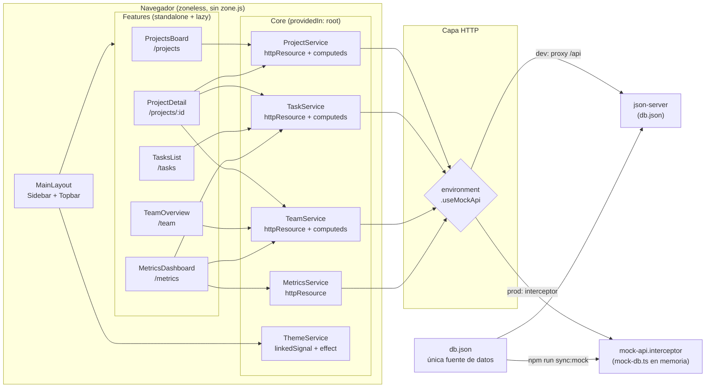

# Arquitectura — ProjectOps Dashboard

Decisiones técnicas del proyecto y el porqué de cada una. Complementa al [README](../README.md); el proceso de generación con IA está en [prompts.md](prompts.md) y el mapa de señales en [signals.md](signals.md).

## Diagrama general



## 1. Angular zoneless: qué cambia de verdad

El proyecto no incluye `zone.js` (default de Angular 21 para apps nuevas). Sin Zone.js, Angular **no** re-renderiza "solo" después de cada evento o petición: solo re-renderiza lo que depende de un signal que cambió.

Consecuencia práctica encontrada en este código: el título del topbar era

```ts
readonly pageTitle = computed(() => {
  const url = this.router.url;   // ❌ no es un signal
  ...
});
```

`router.url` es un getter normal: el `computed` se evalúa una vez y **nunca** se recalcula, así que el título se quedaba congelado al navegar. Con Zone.js el bug quedaba enmascarado (cualquier evento re-renderizaba todo). El arreglo es convertir la navegación en señal:

```ts
private readonly url = toSignal(
  this.router.events.pipe(filter(e => e instanceof NavigationEnd), map(() => this.router.url)),
  { initialValue: this.router.url }
);
```

**Regla que deja este proyecto:** en zoneless, todo lo que la vista lee debe ser signal o derivar de uno.

## 2. Capa de datos: httpResource + mutaciones optimistas

Cada feature tiene un servicio `providedIn: 'root'` con esta forma:

```ts
private readonly resource = httpResource<Project[]>(() => API, { defaultValue: [] });

readonly projects = this.resource.value.asReadonly();
readonly loading  = this.resource.isLoading;
readonly error    = computed(() => this.mutationError() ?? this.resource.error()?.message ?? null);
```

- **Lecturas**: `httpResource` dispara la petición al crearse el servicio y expone `value`/`isLoading`/`error` como signals. Los componentes ya no llaman a ningún `loadAll()`: inyectar el servicio basta.
- **Derivaciones**: todo lo que antes serían métodos con lógica repetida son `computed` (`byStatus`, `completionRate`, `avgProgress`…). Se memorizan y solo se recalculan si cambia la lista.
- **Mutaciones**: POST/PATCH/DELETE con `HttpClient` y, al confirmar el servidor, se escribe en `resource.value` (es un `WritableSignal` precisamente para esto). Sin refetch: una mutación no cuesta dos peticiones.
- Los errores de mutación van en un signal aparte y se funden con el error de carga en un único `error()` público.

`httpResource` es API experimental; si cambiara, el blast radius es pequeño porque los componentes solo conocen los signals públicos del servicio, no el recurso.

## 3. Una API, dos backends

Objetivo: que la demo desplegada funcione sin servidor, sin bifurcar el código de la app.

```
                        ┌── dev (ng serve) ──► proxy /api ──► json-server (db.json)
componentes ─► servicios┤
                        └── prod (build)  ──► mockApiInterceptor (mock-db.ts en memoria)
```

- `db.json` es la única fuente de datos. `scripts/sync-mock.mjs` la convierte en `mock-db.ts` tipado (enganchado a `prebuild`, imposible olvidarlo).
- `mock-api.interceptor.ts` replica el contrato de json-server: GET/POST/PATCH/DELETE sobre `/api/projects|tasks|team` y `/api/metrics/main`, con latencia simulada de 250 ms para que los spinners existan de verdad.
- El gate está en `app.config.ts` (`environment.useMockApi` decide si el interceptor se registra). El interceptor en sí no conoce el entorno: por eso se testea como función pura, sin TestBed.
- Los entornos se alternan con `fileReplacements` (patrón estándar de Angular).

Esta pieza es **reutilizable tal cual** en cualquier proyecto Angular que necesite demo sin backend: interceptor + script de sincronización + flag de entorno.

## 4. Tema claro/oscuro: linkedSignal y tokens

- `styles.scss` define los design tokens (`--bg`, `--surface`, `--border`, `--text*`, `--chip-*`) en `:root` y los redefine bajo `[data-theme="dark"]`. Los componentes solo usan variables: ningún hex de tema hardcodeado.
- `ThemeService` usa el caso canónico de `linkedSignal`: el tema **sigue** `prefers-color-scheme` del sistema como default, un `set()` del usuario lo pisa, y un cambio posterior del sistema recupera el control. `effect()` estampa `data-theme` en `<html>` y `localStorage` persiste la elección.
- Excepción: Chart.js pinta en canvas y no ve variables CSS. `ChartWrapper` deriva sus colores de texto/rejilla del signal del tema, así los charts se redibujan al cambiar.

## 5. Routing moderno

- Standalone + `loadComponent` por ruta: cada vista es un chunk lazy (verificable en la salida del build).
- `withComponentInputBinding()`: el `:id` de `/projects/:id` llega al componente como `input.required<string>()`. Fuera `ActivatedRoute`, `paramMap` y la suscripción con `takeUntilDestroyed` — el detalle de proyecto no tiene ni una línea de RxJS.

## 6. Tests (vitest)

`ng test` usa el builder `@angular/build:unit-test` con vitest + jsdom. Criterio: probar el **contrato** de cada pieza, no su implementación.

| Suite | Qué cubre |
|-------|-----------|
| `*.service.spec.ts` | Carga inicial de httpResource (con `HttpTestingController`), computeds derivados, mutaciones optimistas, errores de mutación |
| `mock-api.interceptor.spec.ts` | CRUD completo del mock, 404, aislamiento entre tests (`resetMockApiStore`) |
| `theme.service.spec.ts` | El contrato de linkedSignal descrito arriba |
| `pipes.spec.ts` | Lógica pura de los tres pipes |

Nota operativa: el pool de vitest va en `threads` (via `vitest.config.ts` + `runnerConfig`) porque el default `forks` requiere `child_process`, restringido en algunos sandboxes de CI.

## Deuda conocida

- `Metrics` viene de un endpoint estático: los KPIs no se recalculan al crear/editar tareas (los charts de carga por miembro sí, porque derivan de los signals de tasks/team).
- Sin manejo de formularios con validación visible (los `required` son HTML nativo).
- `httpResource` y `linkedSignal` son APIs marcadas como experimentales/en evolución en Angular 21.
