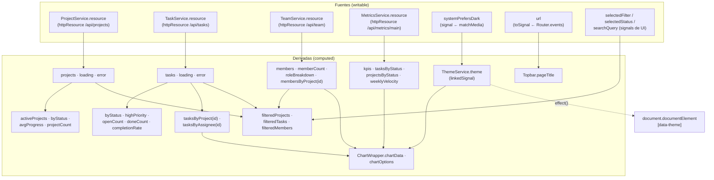

# Señales del sistema y sus relaciones

Mapa de la reactividad del dashboard: qué señales existen, de cuáles derivan y quién las consume. En zoneless este grafo **es** el sistema de render: solo se repinta lo que depende de una señal que cambió.

## Grafo de dependencias

## Catálogo por servicio

### ProjectService / TaskService / TeamService (mismo patrón)

| Señal | Tipo | Deriva de | Consumidores |
|-------|------|-----------|--------------|
| `resource.value` | `httpResource` (writable) | GET inicial + mutaciones optimistas | todo lo demás |
| `projects` / `tasks` / `members` | readonly del anterior | `resource.value` | componentes y computeds |
| `loading` | `resource.isLoading` | estado del recurso | spinners |
| `error` | `computed` | `resource.error` + `mutationError` | empty-states de error |
| `byStatus`, `avgProgress`, `completionRate`, `highPriority`, `openCount`, `doneCount`, `roleBreakdown`… | `computed` | la lista | cabeceras, resúmenes, charts |
| `tasksByProject(id)`, `membersByProject(id)`, `projectById(id)` | fábricas de `computed` | lista + id | detalle de proyecto, contadores |

Las **mutaciones** (add/update/remove) no son señales: son métodos que, al confirmar el servidor, escriben en `resource.value` — y el grafo entero reacciona solo.

### ThemeService

| Señal | Tipo | Contrato |
|-------|------|----------|
| `systemPrefersDark` | `signal` | espejo de `matchMedia('(prefers-color-scheme: dark)')` |
| `theme` | **`linkedSignal`** | sigue a `systemPrefersDark` como default; `set()` del usuario la pisa **hasta el siguiente cambio de la fuente** |
| — | `effect` | estampa `data-theme` en `<html>`; el CSS hace el resto via tokens |

### Señales de UI (componentes)

- `selectedFilter`, `selectedStatus`, `searchQuery`, `modalOpen`, `editingId`: estado local de vista (`signal`).
- `filteredProjects` / `filteredTasks` / `filteredMembers`: `computed` que cruzan datos del servicio con filtros de UI — el punto donde se unen los dos mundos.
- `ProjectDetail.id`: `input.required<string>()` — el router lo alimenta (`withComponentInputBinding`), y de él cuelgan `project`, `projectTasks` y `projectMembers`.
- `Topbar.url`: `toSignal` sobre `Router.events` — la corrección zoneless documentada en [architecture.md](architecture.md#1-angular-zoneless-qué-cambia-de-verdad).

## Las tres reglas que deja el mapa

1. **Una sola fuente writable por dominio** (`resource.value`); todo lo demás deriva. Nadie hace `set()` en dos sitios.
2. **Los componentes no combinan datos crudos**: consumen computeds del servicio y solo añaden sus filtros de UI.
3. **Lo que la vista lee es señal o deriva de una** — o no se repinta (zoneless no perdona).
